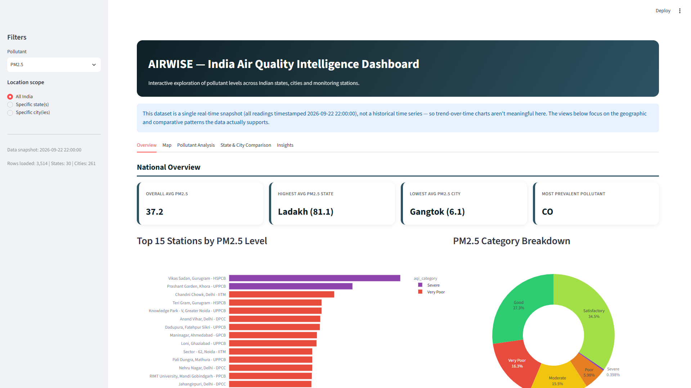
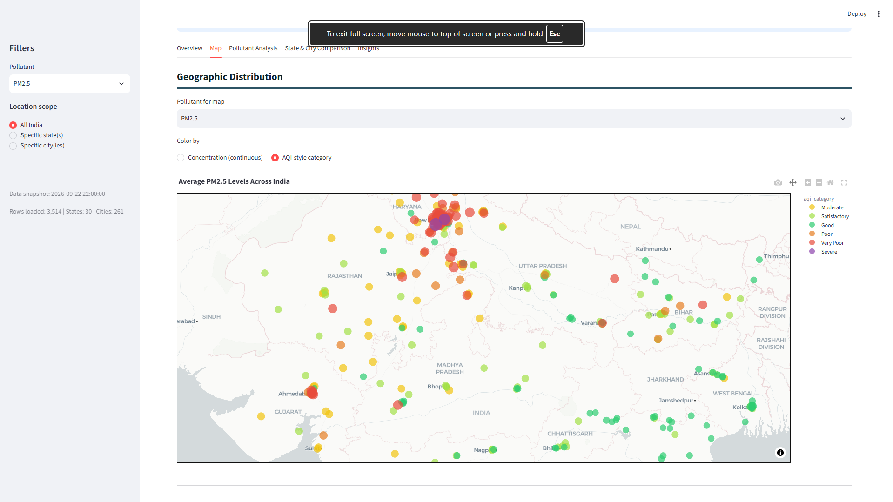
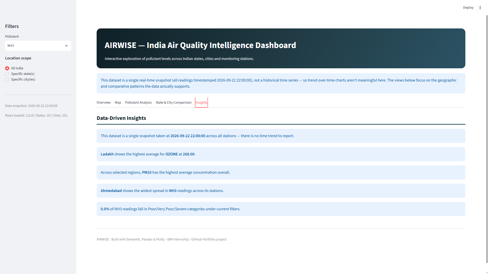

# 🌏 AIRWISE – India Air Quality Intelligence Dashboard

> A Streamlit-powered dashboard for exploring and understanding air quality across India's states and cities.

---

## 📖 Table of Contents

- [Project Overview](#-project-overview)
- [Key Features](#-key-features)
- [Screenshots](#-screenshots)
- [Dataset Information](#-dataset-information)
- [Official Data Source](#-official-data-source)
- [Data Preparation](#-data-preparation)
- [Technologies Used](#-technologies-used)
- [Project Structure](#-project-structure)
- [How to Run](#-how-to-run)
- [Important Dataset Limitation](#-important-dataset-limitation)
- [Future Scope](#-future-scope)

---

## 📌 Project Overview

**AIRWISE** is a professional Streamlit application that delivers comprehensive insights into air quality across Indian states and cities. It transforms raw pollution monitoring data into interactive maps, charts, and comparisons — helping users understand pollutant levels, geographical hotspots, and state/city rankings at a glance. The dashboard combines clean visual design with data-driven summaries to make air quality information accessible to everyone.

---

## ✨ Key Features

| Feature | Description |
|---|---|
| 🇮🇳 **National Overview** | KPIs and headline statistics — average pollutant levels, and the states/cities with the most extreme air quality conditions. |
| 🗺️ **India Map** | Interactive geographic map plotting pollutant levels by station, with filters for state, city, and pollutant type. |
| 🧪 **Pollutant Analysis** | Visual comparison of pollutant concentrations (PM2.5, NO2, SO2, etc.) across regions. |
| 🏙️ **State & City Comparison** | Side-by-side rankings and comparisons identifying top and bottom performing states/cities. |
| 🤖 **AI/Data-Driven Insights** | Auto-generated textual summaries that highlight key findings and patterns in the data. |

---

## 📸 Screenshots

#### 🇮🇳 National Overview


#### 🗺️ Interactive India Map


#### 🧪 Pollutant Analysis


#### 🏙️ State & City Comparison


#### 🤖 AI Insights


---

## 📊 Dataset Information

| Detail | Value |
|---|---|
| **Filename** | `Air quality in india.csv` |
| **Rows** | 3,514 |
| **Columns** | 11 |

**Column Description:**

| Column | Description |
|---|---|
| `country` | Country of the monitoring station (India) |
| `state` | State where the station is located |
| `city` | City where the station is located |
| `station` | Name/identifier of the monitoring station |
| `last_update` | Timestamp of the recorded observation |
| `latitude` | Geographical latitude of the station |
| `longitude` | Geographical longitude of the station |
| `pollutant_id` | Type of pollutant measured (e.g., PM2.5, PM10, NO2, SO2) |
| `pollutant_min` | Minimum recorded pollutant level |
| `pollutant_max` | Maximum recorded pollutant level |
| `pollutant_avg` | Average recorded pollutant level |

---

## ⭐ Official Data Source

This dataset is sourced from real-time air quality monitoring data published on the **Open Government Data (OGD) Platform India** (data.gov.in), based on measurements from the **Central Pollution Control Board (CPCB)**.

- **Platform:** Open Government Data (OGD) Platform India
- **Original Data Provider:** Central Pollution Control Board (CPCB)
- **Resource Link:** [Real-time Air Quality Index - OGD India](https://www.data.gov.in/resource/real-time-air-quality-index-various-locations)

---

## 🧹 Data Preparation

The raw dataset was cleaned and prepared before being used in the dashboard:

- **Missing-value handling** – Rows/fields with missing or null pollutant readings were identified and handled appropriately (dropped or flagged) to avoid skewing analysis.
- **Data-type conversion** – Numeric columns (`pollutant_min`, `pollutant_max`, `pollutant_avg`, `latitude`, `longitude`) were converted to proper numeric types for accurate calculations.
- **Timestamp parsing** – The `last_update` column was parsed into a proper datetime format to enable consistent filtering and display.
- **Invalid-record handling** – Records with malformed, out-of-range, or inconsistent values (e.g., invalid coordinates or negative pollutant readings) were identified and excluded from analysis.

---

## 🛠️ Technologies Used

- **Python** – Core programming language
- **Streamlit** – Interactive web application framework
- **Pandas** – Data manipulation and analysis
- **NumPy** – Numerical operations
- **Plotly** – Interactive charts and maps

---

## 📁 Project Structure

```
AIRWISE/
├── app.py
├── requirements.txt
├── README.md
├── AIRWISE_Project_Report.pdf
├── Air quality in india.csv
├── Overview.png
├── Map.png
├── Pollutant Analysis.png
├── States and cities comparison.png
└── Inghts.png
```

---

## 🚀 How to Run

1. **Clone/download** the project files into a single directory.
2. **Install dependencies:**
   ```bash
   pip install -r requirements.txt
   ```
3. **Run the app:**
   ```bash
   streamlit run app.py
   ```
4. **Open the dashboard:** Streamlit will launch automatically in your browser, or provide a local URL (usually `http://localhost:8501`) to open manually.

---

## ⚠️ Important Dataset Limitation

The dataset used in this project represents a **recent/current observation snapshot** of air quality readings from CPCB monitoring stations — it is **not a complete historical time series**.

As a result:
- This project **does not claim to show historical trends** over time.
- This project **does not perform or claim future forecasting**.
- All insights, comparisons, and visualizations reflect the data as captured at the time of collection, not long-term patterns.

---

## 🔭 Future Scope

- 🔌 **Live API Integration** – Connect directly to CPCB/OGD real-time APIs instead of a static CSV.
- 📈 **Historical Data Analysis** – Incorporate multi-year data to identify genuine seasonal and long-term trends.
- 🔮 **Forecasting** – Apply time-series models to predict future pollutant levels.
- 🚨 **Alerts** – Notify users when pollutant levels cross hazardous thresholds.
- ☁️ **Online Deployment** – Host the dashboard publicly (e.g., Streamlit Community Cloud) for wider access.

---

*Built with ❤️ using Streamlit to make India's air quality data more accessible.*
